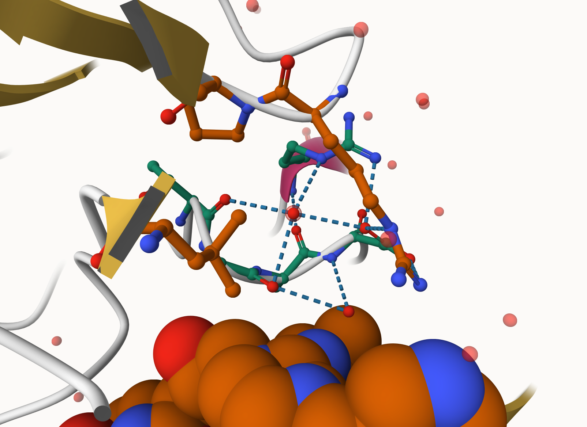
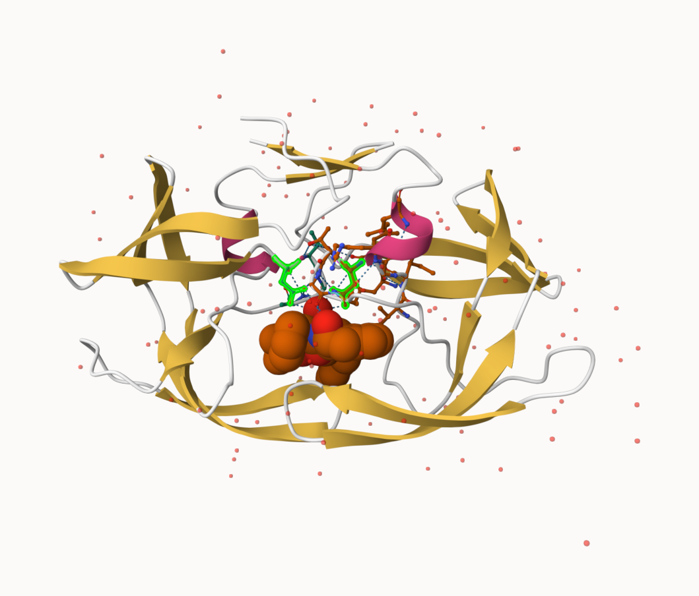
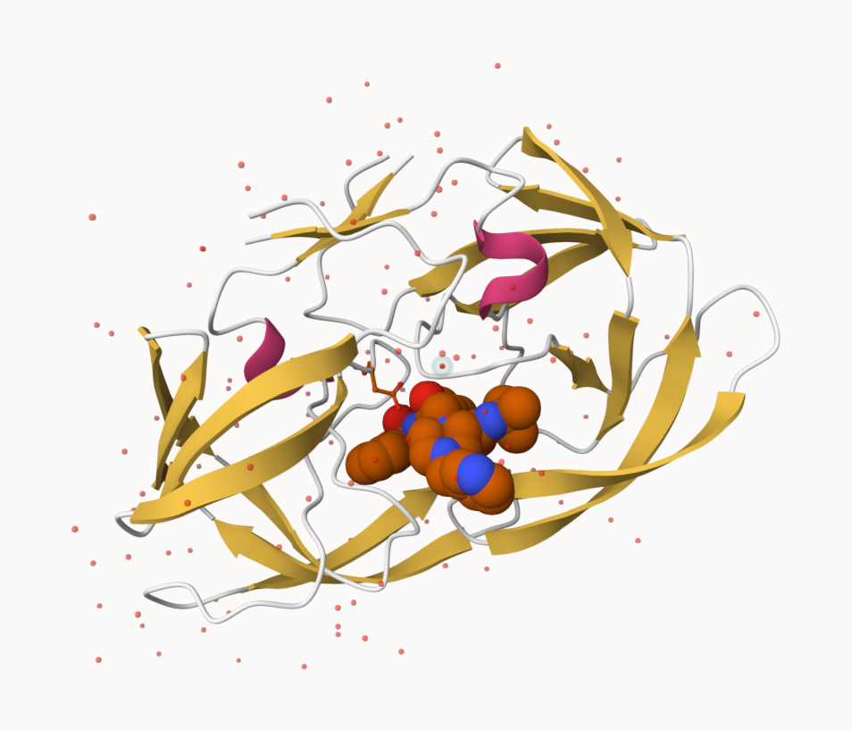

```{r}
data<-read.csv("Data Export Summary.csv")
head(data)
```

>Q1: What percentage of structures in the PDB are solved by X-Ray and Electron Microscopy.

```{r}
#For x-ray: 
188747/226707*100
#For electron microscopy:
23203/226707*100
```

>Q2: What proportion of structures in the PDB are protein?

```{r}
195866/226707
```

>Q3: Type HIV in the PDB website search box on the home page and determine how many HIV-1 protease structures are in the current PDB?
>ANS: 4,563 Structures


>Q4: Water molecules normally have 3 atoms. Why do we see just one atom per water molecule in this structure?

>ANS: We use Ball and Stick. Hydrogens aren't shown in this mode and Oxygen is represented by a red dot .

>Q5: There is a critical “conserved” water molecule in the binding site. Can you identify this water molecule? What residue number does this water molecule have
>ANS:HOH at 324

```{r}

```


>Q6: Generate and save a figure clearly showing the two distinct chains of HIV-protease along with the ligand. You might also consider showing the catalytic residues ASP 25 in each chain and the critical water (we recommend “Ball & Stick” for these side-chains). Add this figure to your Quarto document.


>ANS:Chain A ASP25 on the right, Chain B ASP25 on the right. 

```{r}
 
```
```{r}
 
```
>Conserved water molecule with a halo.

Reading PDB file data into R

```{r}
library(bio3d)
```


```{r}
pdb <- read.pdb("1hsg")
pdb
```

>Q7: How many amino acid residues are there in this pdb object?
>ANS:198

>Q8: Name one of the two non-protein residues? 
>ANS:HOH

>Q9: How many protein chains are in this structure?
>ANS:2


```{r}
attributes(pdb)
head(pdb$atom)
```

```{r}
adk <- read.pdb("6s36")
adk
```
```{r}
# Perform flexiblity prediction
m <- nma(adk)
plot(m)
mktrj(m, file="adk_m7.pdb")
```

Comparative structure analysis of Adenylate Kinase

```{r}
# Install packages in the R console NOT your Rmd/Quarto file

#install.packages("bio3d")
#install.packages("devtools")
#install.packages("BiocManager")

#BiocManager::install("msa")
#devtools::install_bitbucket("Grantlab/bio3d-view")
```

>Q10. Which of the packages above is found only on BioConductor and not CRAN? 
>ANS:msa

>Q11. Which of the above packages is not found on BioConductor or CRAN?: 
>ANS:bio3d-view

>Q12. True or False? Functions from the devtools package can be used to install packages from GitHub and BitBucket?
>ANS:True


```{r}
library(bio3d)
aa <- get.seq("1ake_A")

aa
```
>Q13. How many amino acids are in this sequence, i.e. how long is this sequence? 
>ANS:214


```{r}
# Blast or hmmer search 
#b <- blast.pdb(aa)

# Plot a summary of search results
#hits <- plot(b)


# List out some 'top hits'
#head(hits$pdb.id)

```

```{r}
hits <- NULL
hits$pdb.id <- c('1AKE_A','6S36_A','6RZE_A','3HPR_A','1E4V_A','5EJE_A','1E4Y_A','3X2S_A','6HAP_A','6HAM_A','4K46_A','3GMT_A','4PZL_A')
```

```{r}
# Download releated PDB files

files <- get.pdb(hits$pdb.id, path="pdbs", split=TRUE, gzip=TRUE)
```

```{r}


# Align releated PDBs
pdbs <- pdbaln(files, fit = TRUE, exefile="msa")
```
```{r}
# Vector containing PDB codes for figure axis
ids <- basename.pdb(pdbs$id)

# Draw schematic alignment
plot(pdbs, labels=ids)
```

```{r}
anno <- pdb.annotate(ids)
unique(anno$source)

anno
```
```{r}
# Perform PCA
pc.xray <- pca(pdbs)
plot(pc.xray)
```
```{r}
# Calculate RMSD
rd <- rmsd(pdbs)

# Structure-based clustering
hc.rd <- hclust(dist(rd))
grps.rd <- cutree(hc.rd, k=3)

plot(pc.xray, 1:2, col="grey50", bg=grps.rd, pch=21, cex=1)

```

