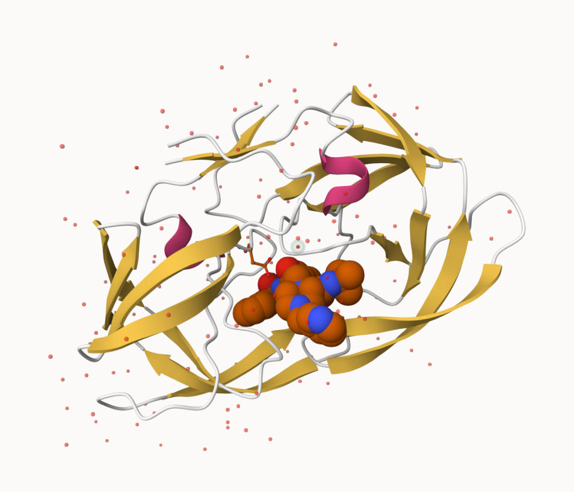

    data<-read.csv("Data Export Summary.csv")
    head(data)

    ##            Molecular.Type   X.ray     EM    NMR Multiple.methods Neutron Other
    ## 1          Protein (only) 167,317 15,698 12,534              208      77    32
    ## 2 Protein/Oligosaccharide   9,645  2,639     34                8       2     0
    ## 3              Protein/NA   8,735  4,718    286                7       0     0
    ## 4     Nucleic acid (only)   2,869    138  1,507               14       3     1
    ## 5                   Other     170     10     33                0       0     0
    ## 6  Oligosaccharide (only)      11      0      6                1       0     4
    ##     Total
    ## 1 195,866
    ## 2  12,328
    ## 3  13,746
    ## 4   4,532
    ## 5     213
    ## 6      22

> Q1: What percentage of structures in the PDB are solved by X-Ray and
> Electron Microscopy.

    #For x-ray: 
    188747/226707*100

    ## [1] 83.25592

    #For electron microscopy:
    23203/226707*100

    ## [1] 10.2348

> Q2: What proportion of structures in the PDB are protein?

    195866/226707

    ## [1] 0.863961

> Q3: Type HIV in the PDB website search box on the home page and
> determine how many HIV-1 protease structures are in the current PDB?
> ANS: 4,563 Structures

> Q4: Water molecules normally have 3 atoms. Why do we see just one atom
> per water molecule in this structure?

> ANS: We use Ball and Stick. Hydrogens aren’t shown in this mode and
> Oxygen is represented by a red dot .

> Q5: There is a critical “conserved” water molecule in the binding
> site. Can you identify this water molecule? What residue number does
> this water molecule have ANS:HOH at 324

    knitr::include_graphics("conservedH.png")

> Q6: Generate and save a figure clearly showing the two distinct chains
> of HIV-protease along with the ligand. You might also consider showing
> the catalytic residues ASP 25 in each chain and the critical water (we
> recommend “Ball & Stick” for these side-chains). Add this figure to
> your Quarto document.

> ANS:Chain A ASP25 on the right, Chain B ASP25 on the right.

     knitr::include_graphics("1HSGall.png")

     

 &gt;Conserved water molecule
with a halo.

Reading PDB file data into R

    library(bio3d)

    ## Warning: 程序包'bio3d'是用R版本4.4.2 来建造的

    pdb <- read.pdb("1hsg")

    ##   Note: Accessing on-line PDB file

    pdb

    ## 
    ##  Call:  read.pdb(file = "1hsg")
    ## 
    ##    Total Models#: 1
    ##      Total Atoms#: 1686,  XYZs#: 5058  Chains#: 2  (values: A B)
    ## 
    ##      Protein Atoms#: 1514  (residues/Calpha atoms#: 198)
    ##      Nucleic acid Atoms#: 0  (residues/phosphate atoms#: 0)
    ## 
    ##      Non-protein/nucleic Atoms#: 172  (residues: 128)
    ##      Non-protein/nucleic resid values: [ HOH (127), MK1 (1) ]
    ## 
    ##    Protein sequence:
    ##       PQITLWQRPLVTIKIGGQLKEALLDTGADDTVLEEMSLPGRWKPKMIGGIGGFIKVRQYD
    ##       QILIEICGHKAIGTVLVGPTPVNIIGRNLLTQIGCTLNFPQITLWQRPLVTIKIGGQLKE
    ##       ALLDTGADDTVLEEMSLPGRWKPKMIGGIGGFIKVRQYDQILIEICGHKAIGTVLVGPTP
    ##       VNIIGRNLLTQIGCTLNF
    ## 
    ## + attr: atom, xyz, seqres, helix, sheet,
    ##         calpha, remark, call

> Q7: How many amino acid residues are there in this pdb object? ANS:198

> Q8: Name one of the two non-protein residues? ANS:HOH

> Q9: How many protein chains are in this structure? ANS:2

    attributes(pdb)

    ## $names
    ## [1] "atom"   "xyz"    "seqres" "helix"  "sheet"  "calpha" "remark" "call"  
    ## 
    ## $class
    ## [1] "pdb" "sse"

    head(pdb$atom)

    ##   type eleno elety  alt resid chain resno insert      x      y     z o     b
    ## 1 ATOM     1     N <NA>   PRO     A     1   <NA> 29.361 39.686 5.862 1 38.10
    ## 2 ATOM     2    CA <NA>   PRO     A     1   <NA> 30.307 38.663 5.319 1 40.62
    ## 3 ATOM     3     C <NA>   PRO     A     1   <NA> 29.760 38.071 4.022 1 42.64
    ## 4 ATOM     4     O <NA>   PRO     A     1   <NA> 28.600 38.302 3.676 1 43.40
    ## 5 ATOM     5    CB <NA>   PRO     A     1   <NA> 30.508 37.541 6.342 1 37.87
    ## 6 ATOM     6    CG <NA>   PRO     A     1   <NA> 29.296 37.591 7.162 1 38.40
    ##   segid elesy charge
    ## 1  <NA>     N   <NA>
    ## 2  <NA>     C   <NA>
    ## 3  <NA>     C   <NA>
    ## 4  <NA>     O   <NA>
    ## 5  <NA>     C   <NA>
    ## 6  <NA>     C   <NA>

    adk <- read.pdb("6s36")

    ##   Note: Accessing on-line PDB file
    ##    PDB has ALT records, taking A only, rm.alt=TRUE

    adk

    ## 
    ##  Call:  read.pdb(file = "6s36")
    ## 
    ##    Total Models#: 1
    ##      Total Atoms#: 1898,  XYZs#: 5694  Chains#: 1  (values: A)
    ## 
    ##      Protein Atoms#: 1654  (residues/Calpha atoms#: 214)
    ##      Nucleic acid Atoms#: 0  (residues/phosphate atoms#: 0)
    ## 
    ##      Non-protein/nucleic Atoms#: 244  (residues: 244)
    ##      Non-protein/nucleic resid values: [ CL (3), HOH (238), MG (2), NA (1) ]
    ## 
    ##    Protein sequence:
    ##       MRIILLGAPGAGKGTQAQFIMEKYGIPQISTGDMLRAAVKSGSELGKQAKDIMDAGKLVT
    ##       DELVIALVKERIAQEDCRNGFLLDGFPRTIPQADAMKEAGINVDYVLEFDVPDELIVDKI
    ##       VGRRVHAPSGRVYHVKFNPPKVEGKDDVTGEELTTRKDDQEETVRKRLVEYHQMTAPLIG
    ##       YYSKEAEAGNTKYAKVDGTKPVAEVRADLEKILG
    ## 
    ## + attr: atom, xyz, seqres, helix, sheet,
    ##         calpha, remark, call

    # Perform flexiblity prediction
    m <- nma(adk)

    ##  Building Hessian...     Done in 0.05 seconds.
    ##  Diagonalizing Hessian...    Done in 0.47 seconds.

    plot(m)

    mktrj(m, file="adk_m7.pdb")

Comparative structure analysis of Adenylate Kinase

    # Install packages in the R console NOT your Rmd/Quarto file

    #install.packages("bio3d")
    #install.packages("devtools")
    #install.packages("BiocManager")

    #BiocManager::install("msa")
    #devtools::install_bitbucket("Grantlab/bio3d-view")

> Q10. Which of the packages above is found only on BioConductor and not
> CRAN? ANS:msa

> Q11. Which of the above packages is not found on BioConductor or
> CRAN?: ANS:bio3d-view

> Q12. True or False? Functions from the devtools package can be used to
> install packages from GitHub and BitBucket? ANS:True

    library(bio3d)
    aa <- get.seq("1ake_A")

    ## Warning in get.seq("1ake_A"): Removing existing file: seqs.fasta

    ## Fetching... Please wait. Done.

    aa

    ##              1        .         .         .         .         .         60 
    ## pdb|1AKE|A   MRIILLGAPGAGKGTQAQFIMEKYGIPQISTGDMLRAAVKSGSELGKQAKDIMDAGKLVT
    ##              1        .         .         .         .         .         60 
    ## 
    ##             61        .         .         .         .         .         120 
    ## pdb|1AKE|A   DELVIALVKERIAQEDCRNGFLLDGFPRTIPQADAMKEAGINVDYVLEFDVPDELIVDRI
    ##             61        .         .         .         .         .         120 
    ## 
    ##            121        .         .         .         .         .         180 
    ## pdb|1AKE|A   VGRRVHAPSGRVYHVKFNPPKVEGKDDVTGEELTTRKDDQEETVRKRLVEYHQMTAPLIG
    ##            121        .         .         .         .         .         180 
    ## 
    ##            181        .         .         .   214 
    ## pdb|1AKE|A   YYSKEAEAGNTKYAKVDGTKPVAEVRADLEKILG
    ##            181        .         .         .   214 
    ## 
    ## Call:
    ##   read.fasta(file = outfile)
    ## 
    ## Class:
    ##   fasta
    ## 
    ## Alignment dimensions:
    ##   1 sequence rows; 214 position columns (214 non-gap, 0 gap) 
    ## 
    ## + attr: id, ali, call

> Q13. How many amino acids are in this sequence, i.e. how long is this
> sequence? ANS:214

    # Blast or hmmer search 
    #b <- blast.pdb(aa)

    # Plot a summary of search results
    #hits <- plot(b)

    # List out some 'top hits'
    #head(hits$pdb.id)

    hits <- NULL
    hits$pdb.id <- c('1AKE_A','6S36_A','6RZE_A','3HPR_A','1E4V_A','5EJE_A','1E4Y_A','3X2S_A','6HAP_A','6HAM_A','4K46_A','3GMT_A','4PZL_A')

    # Download releated PDB files

    files <- get.pdb(hits$pdb.id, path="pdbs", split=TRUE, gzip=TRUE)

    ## Warning in get.pdb(hits$pdb.id, path = "pdbs", split = TRUE, gzip = TRUE):
    ## pdbs/1AKE.pdb exists. Skipping download

    ## Warning in get.pdb(hits$pdb.id, path = "pdbs", split = TRUE, gzip = TRUE):
    ## pdbs/6S36.pdb exists. Skipping download

    ## Warning in get.pdb(hits$pdb.id, path = "pdbs", split = TRUE, gzip = TRUE):
    ## pdbs/6RZE.pdb exists. Skipping download

    ## Warning in get.pdb(hits$pdb.id, path = "pdbs", split = TRUE, gzip = TRUE):
    ## pdbs/3HPR.pdb exists. Skipping download

    ## Warning in get.pdb(hits$pdb.id, path = "pdbs", split = TRUE, gzip = TRUE):
    ## pdbs/1E4V.pdb exists. Skipping download

    ## Warning in get.pdb(hits$pdb.id, path = "pdbs", split = TRUE, gzip = TRUE):
    ## pdbs/5EJE.pdb exists. Skipping download

    ## Warning in get.pdb(hits$pdb.id, path = "pdbs", split = TRUE, gzip = TRUE):
    ## pdbs/1E4Y.pdb exists. Skipping download

    ## Warning in get.pdb(hits$pdb.id, path = "pdbs", split = TRUE, gzip = TRUE):
    ## pdbs/3X2S.pdb exists. Skipping download

    ## Warning in get.pdb(hits$pdb.id, path = "pdbs", split = TRUE, gzip = TRUE):
    ## pdbs/6HAP.pdb exists. Skipping download

    ## Warning in get.pdb(hits$pdb.id, path = "pdbs", split = TRUE, gzip = TRUE):
    ## pdbs/6HAM.pdb exists. Skipping download

    ## Warning in get.pdb(hits$pdb.id, path = "pdbs", split = TRUE, gzip = TRUE):
    ## pdbs/4K46.pdb exists. Skipping download

    ## Warning in get.pdb(hits$pdb.id, path = "pdbs", split = TRUE, gzip = TRUE):
    ## pdbs/3GMT.pdb exists. Skipping download

    ## Warning in get.pdb(hits$pdb.id, path = "pdbs", split = TRUE, gzip = TRUE):
    ## pdbs/4PZL.pdb exists. Skipping download

    ##   |                                                                              |                                                                      |   0%  |                                                                              |=====                                                                 |   8%  |                                                                              |===========                                                           |  15%  |                                                                              |================                                                      |  23%  |                                                                              |======================                                                |  31%  |                                                                              |===========================                                           |  38%  |                                                                              |================================                                      |  46%  |                                                                              |======================================                                |  54%  |                                                                              |===========================================                           |  62%  |                                                                              |================================================                      |  69%  |                                                                              |======================================================                |  77%  |                                                                              |===========================================================           |  85%  |                                                                              |=================================================================     |  92%  |                                                                              |======================================================================| 100%

    # Align releated PDBs
    pdbs <- pdbaln(files, fit = TRUE, exefile="msa")

    ## Reading PDB files:
    ## pdbs/split_chain/1AKE_A.pdb
    ## pdbs/split_chain/6S36_A.pdb
    ## pdbs/split_chain/6RZE_A.pdb
    ## pdbs/split_chain/3HPR_A.pdb
    ## pdbs/split_chain/1E4V_A.pdb
    ## pdbs/split_chain/5EJE_A.pdb
    ## pdbs/split_chain/1E4Y_A.pdb
    ## pdbs/split_chain/3X2S_A.pdb
    ## pdbs/split_chain/6HAP_A.pdb
    ## pdbs/split_chain/6HAM_A.pdb
    ## pdbs/split_chain/4K46_A.pdb
    ## pdbs/split_chain/3GMT_A.pdb
    ## pdbs/split_chain/4PZL_A.pdb
    ##    PDB has ALT records, taking A only, rm.alt=TRUE
    ## .   PDB has ALT records, taking A only, rm.alt=TRUE
    ## .   PDB has ALT records, taking A only, rm.alt=TRUE
    ## .   PDB has ALT records, taking A only, rm.alt=TRUE
    ## ..   PDB has ALT records, taking A only, rm.alt=TRUE
    ## ....   PDB has ALT records, taking A only, rm.alt=TRUE
    ## .   PDB has ALT records, taking A only, rm.alt=TRUE
    ## ...
    ## 
    ## Extracting sequences
    ## 
    ## pdb/seq: 1   name: pdbs/split_chain/1AKE_A.pdb 
    ##    PDB has ALT records, taking A only, rm.alt=TRUE
    ## pdb/seq: 2   name: pdbs/split_chain/6S36_A.pdb 
    ##    PDB has ALT records, taking A only, rm.alt=TRUE
    ## pdb/seq: 3   name: pdbs/split_chain/6RZE_A.pdb 
    ##    PDB has ALT records, taking A only, rm.alt=TRUE
    ## pdb/seq: 4   name: pdbs/split_chain/3HPR_A.pdb 
    ##    PDB has ALT records, taking A only, rm.alt=TRUE
    ## pdb/seq: 5   name: pdbs/split_chain/1E4V_A.pdb 
    ## pdb/seq: 6   name: pdbs/split_chain/5EJE_A.pdb 
    ##    PDB has ALT records, taking A only, rm.alt=TRUE
    ## pdb/seq: 7   name: pdbs/split_chain/1E4Y_A.pdb 
    ## pdb/seq: 8   name: pdbs/split_chain/3X2S_A.pdb 
    ## pdb/seq: 9   name: pdbs/split_chain/6HAP_A.pdb 
    ## pdb/seq: 10   name: pdbs/split_chain/6HAM_A.pdb 
    ##    PDB has ALT records, taking A only, rm.alt=TRUE
    ## pdb/seq: 11   name: pdbs/split_chain/4K46_A.pdb 
    ##    PDB has ALT records, taking A only, rm.alt=TRUE
    ## pdb/seq: 12   name: pdbs/split_chain/3GMT_A.pdb 
    ## pdb/seq: 13   name: pdbs/split_chain/4PZL_A.pdb

    # Vector containing PDB codes for figure axis
    ids <- basename.pdb(pdbs$id)

    # Draw schematic alignment
    plot(pdbs, labels=ids)

    anno <- pdb.annotate(ids)
    unique(anno$source)

    ## [1] "Escherichia coli"                                
    ## [2] "Escherichia coli K-12"                           
    ## [3] "Escherichia coli O139:H28 str. E24377A"          
    ## [4] "Escherichia coli str. K-12 substr. MDS42"        
    ## [5] "Photobacterium profundum"                        
    ## [6] "Burkholderia pseudomallei 1710b"                 
    ## [7] "Francisella tularensis subsp. tularensis SCHU S4"

    anno

    ##        structureId chainId macromoleculeType chainLength experimentalTechnique
    ## 1AKE_A        1AKE       A           Protein         214                 X-ray
    ## 6S36_A        6S36       A           Protein         214                 X-ray
    ## 6RZE_A        6RZE       A           Protein         214                 X-ray
    ## 3HPR_A        3HPR       A           Protein         214                 X-ray
    ## 1E4V_A        1E4V       A           Protein         214                 X-ray
    ## 5EJE_A        5EJE       A           Protein         214                 X-ray
    ## 1E4Y_A        1E4Y       A           Protein         214                 X-ray
    ## 3X2S_A        3X2S       A           Protein         214                 X-ray
    ## 6HAP_A        6HAP       A           Protein         214                 X-ray
    ## 6HAM_A        6HAM       A           Protein         214                 X-ray
    ## 4K46_A        4K46       A           Protein         214                 X-ray
    ## 3GMT_A        3GMT       A           Protein         230                 X-ray
    ## 4PZL_A        4PZL       A           Protein         242                 X-ray
    ##        resolution       scopDomain                                        pfam
    ## 1AKE_A       2.00 Adenylate kinase Adenylate kinase, active site lid (ADK_lid)
    ## 6S36_A       1.60             <NA>                      Adenylate kinase (ADK)
    ## 6RZE_A       1.69             <NA>                      Adenylate kinase (ADK)
    ## 3HPR_A       2.00             <NA>                      Adenylate kinase (ADK)
    ## 1E4V_A       1.85 Adenylate kinase                      Adenylate kinase (ADK)
    ## 5EJE_A       1.90             <NA>                      Adenylate kinase (ADK)
    ## 1E4Y_A       1.85 Adenylate kinase                      Adenylate kinase (ADK)
    ## 3X2S_A       2.80             <NA>                      Adenylate kinase (ADK)
    ## 6HAP_A       2.70             <NA>                      Adenylate kinase (ADK)
    ## 6HAM_A       2.55             <NA>                      Adenylate kinase (ADK)
    ## 4K46_A       2.01             <NA>                      Adenylate kinase (ADK)
    ## 3GMT_A       2.10             <NA> Adenylate kinase, active site lid (ADK_lid)
    ## 4PZL_A       2.10             <NA>                      Adenylate kinase (ADK)
    ##                ligandId
    ## 1AKE_A              AP5
    ## 6S36_A MG (2),CL (3),NA
    ## 6RZE_A    NA (3),CL (2)
    ## 3HPR_A              AP5
    ## 1E4V_A              AP5
    ## 5EJE_A           AP5,CO
    ## 1E4Y_A              AP5
    ## 3X2S_A   AP5,JPY (2),MG
    ## 6HAP_A              AP5
    ## 6HAM_A              AP5
    ## 4K46_A      ADP,AMP,PO4
    ## 3GMT_A          SO4 (2)
    ## 4PZL_A       CA,FMT,GOL
    ##                                                                              ligandName
    ## 1AKE_A                                                 BIS(ADENOSINE)-5'-PENTAPHOSPHATE
    ## 6S36_A                                    MAGNESIUM ION (2),CHLORIDE ION (3),SODIUM ION
    ## 6RZE_A                                                  SODIUM ION (3),CHLORIDE ION (2)
    ## 3HPR_A                                                 BIS(ADENOSINE)-5'-PENTAPHOSPHATE
    ## 1E4V_A                                                 BIS(ADENOSINE)-5'-PENTAPHOSPHATE
    ## 5EJE_A                                 BIS(ADENOSINE)-5'-PENTAPHOSPHATE,COBALT (II) ION
    ## 1E4Y_A                                                 BIS(ADENOSINE)-5'-PENTAPHOSPHATE
    ## 3X2S_A BIS(ADENOSINE)-5'-PENTAPHOSPHATE,N-(pyren-1-ylmethyl)acetamide (2),MAGNESIUM ION
    ## 6HAP_A                                                 BIS(ADENOSINE)-5'-PENTAPHOSPHATE
    ## 6HAM_A                                                 BIS(ADENOSINE)-5'-PENTAPHOSPHATE
    ## 4K46_A                   ADENOSINE-5'-DIPHOSPHATE,ADENOSINE MONOPHOSPHATE,PHOSPHATE ION
    ## 3GMT_A                                                                  SULFATE ION (2)
    ## 4PZL_A                                                 CALCIUM ION,FORMIC ACID,GLYCEROL
    ##                                                  source
    ## 1AKE_A                                 Escherichia coli
    ## 6S36_A                                 Escherichia coli
    ## 6RZE_A                                 Escherichia coli
    ## 3HPR_A                            Escherichia coli K-12
    ## 1E4V_A                                 Escherichia coli
    ## 5EJE_A           Escherichia coli O139:H28 str. E24377A
    ## 1E4Y_A                                 Escherichia coli
    ## 3X2S_A         Escherichia coli str. K-12 substr. MDS42
    ## 6HAP_A           Escherichia coli O139:H28 str. E24377A
    ## 6HAM_A                            Escherichia coli K-12
    ## 4K46_A                         Photobacterium profundum
    ## 3GMT_A                  Burkholderia pseudomallei 1710b
    ## 4PZL_A Francisella tularensis subsp. tularensis SCHU S4
    ##                                                                                                                                                                      structureTitle
    ## 1AKE_A STRUCTURE OF THE COMPLEX BETWEEN ADENYLATE KINASE FROM ESCHERICHIA COLI AND THE INHIBITOR AP5A REFINED AT 1.9 ANGSTROMS RESOLUTION: A MODEL FOR A CATALYTIC TRANSITION STATE
    ## 6S36_A                                                                                                                   Crystal structure of E. coli Adenylate kinase R119K mutant
    ## 6RZE_A                                                                                                                   Crystal structure of E. coli Adenylate kinase R119A mutant
    ## 3HPR_A                                                                                               Crystal structure of V148G adenylate kinase from E. coli, in complex with Ap5A
    ## 1E4V_A                                                                                                       Mutant G10V of adenylate kinase from E. coli, modified in the Gly-loop
    ## 5EJE_A                                                                                  Crystal structure of E. coli Adenylate kinase G56C/T163C double mutant in complex with Ap5a
    ## 1E4Y_A                                                                                                        Mutant P9L of adenylate kinase from E. coli, modified in the Gly-loop
    ## 3X2S_A                                                                                                                      Crystal structure of pyrene-conjugated adenylate kinase
    ## 6HAP_A                                                                                                                                                             Adenylate kinase
    ## 6HAM_A                                                                                                                                                             Adenylate kinase
    ## 4K46_A                                                                                                          Crystal Structure of Adenylate Kinase from Photobacterium profundum
    ## 3GMT_A                                                                                                         Crystal structure of adenylate kinase from burkholderia pseudomallei
    ## 4PZL_A                                                                              The crystal structure of adenylate kinase from Francisella tularensis subsp. tularensis SCHU S4
    ##                                                      citation rObserved   rFree
    ## 1AKE_A                 Muller, C.W., et al. J Mol Biol (1992)   0.19600      NA
    ## 6S36_A                  Rogne, P., et al. Biochemistry (2019)   0.16320 0.23560
    ## 6RZE_A                  Rogne, P., et al. Biochemistry (2019)   0.18650 0.23500
    ## 3HPR_A  Schrank, T.P., et al. Proc Natl Acad Sci U S A (2009)   0.21000 0.24320
    ## 1E4V_A                   Muller, C.W., et al. Proteins (1993)   0.19600      NA
    ## 5EJE_A  Kovermann, M., et al. Proc Natl Acad Sci U S A (2017)   0.18890 0.23580
    ## 1E4Y_A                   Muller, C.W., et al. Proteins (1993)   0.17800      NA
    ## 3X2S_A                Fujii, A., et al. Bioconjug Chem (2015)   0.20700 0.25600
    ## 6HAP_A               Kantaev, R., et al. J Phys Chem B (2018)   0.22630 0.27760
    ## 6HAM_A               Kantaev, R., et al. J Phys Chem B (2018)   0.20511 0.24325
    ## 4K46_A                    Cho, Y.-J., et al. To be published    0.17000 0.22290
    ## 3GMT_A Buchko, G.W., et al. Biochem Biophys Res Commun (2010)   0.23800 0.29500
    ## 4PZL_A                       Tan, K., et al. To be published    0.19360 0.23680
    ##          rWork spaceGroup
    ## 1AKE_A 0.19600  P 21 2 21
    ## 6S36_A 0.15940    C 1 2 1
    ## 6RZE_A 0.18190    C 1 2 1
    ## 3HPR_A 0.20620  P 21 21 2
    ## 1E4V_A 0.19600  P 21 2 21
    ## 5EJE_A 0.18630  P 21 2 21
    ## 1E4Y_A 0.17800   P 1 21 1
    ## 3X2S_A 0.20700 P 21 21 21
    ## 6HAP_A 0.22370    I 2 2 2
    ## 6HAM_A 0.20311       P 43
    ## 4K46_A 0.16730 P 21 21 21
    ## 3GMT_A 0.23500   P 1 21 1
    ## 4PZL_A 0.19130       P 32

    # Perform PCA
    pc.xray <- pca(pdbs)
    plot(pc.xray)

    # Calculate RMSD
    rd <- rmsd(pdbs)

    ## Warning in rmsd(pdbs): No indices provided, using the 204 non NA positions

    # Structure-based clustering
    hc.rd <- hclust(dist(rd))
    grps.rd <- cutree(hc.rd, k=3)

    plot(pc.xray, 1:2, col="grey50", bg=grps.rd, pch=21, cex=1)

